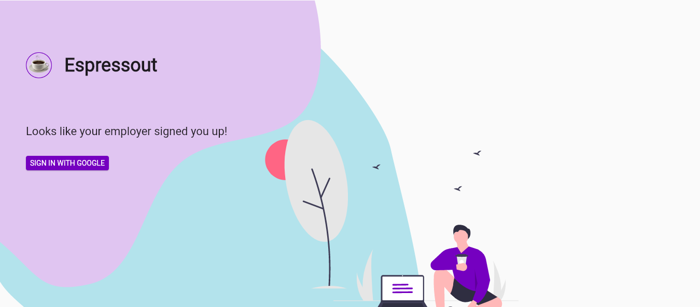

<h1> 
 START HACK 2021 
 </h1>

<h5> 
 The beginning of a wonderful journey for the START HACK team of: 
 </h1>
<h6> 
 Alberto - Product Designer & Facilitator [Italy] 
 </h6>
<h6> 
 Michael - Software Developer [Ireland] 
 </h6>
<h6> 
 Sherry - Product Manager [India] 
 </h6>
<h6> 
 Sebastian - Software Developer & Decision Maker [Switzerland] 
 </h6>
 
<h4> 
 https://start-hack-d0c66.firebaseapp.com/#/ 
 </h4>

  

<h2> <b> Accenture Case Statement - </b> Future of Work </h2>

Most of us at Accenture have been working from home due to the pandemic. Working on projects while managing your household has been a juggling act for all of us.

The kids make surprise visits to your room during an important client call. Your physical fitness is lacking as you barely leave the house. The workdays get longer and it’s becoming harder to distinguish between work and private life.

From time-management, to fitness, to mental health, virtual meetups & games etc. In this new way of working, we would like to give you, the hackers, the opportunity to think of ways to improve the WFH experience for the hundreds of thousands of people like you & us who are embarking on the journey to the future of work.

<h4> Inspriational Themes </h4>

🧘‍♀️   Mindfullness & Motivation

🧠   Better Focus (Reducing distractions / interruptions)

🏋️‍♂️   Home Fitness

⚖️   Improving Work-Life Balance (Less work, more life) 

🌍   Remote Onboarding Experience (Company New Joiners)  

### Our Product Vision
Tired of working? Looking for ‘water cooler’ chats? Hop in on our Social platform and open a break out room to connect with your colleagues, play a game, go for walks together or listen to your CEO talking about latest company news..

### Use Case:
- Engagement with co-workers
- Increase happiness and fitness quotient
- Informal setup with no prior scheduling required
- Easy to use, flexible and not restricted
- Screen time breaks

### Features:
- All Company Employees can activate their account
- New Employees (special tag) can find people to connect and start a conversation
- Follow people and get notifications on events
- Get Personalised notification about breakout rooms and also reminders to take a coffee break
- Create a invite only or open to all breakout room
- Timed Categorised rooms like Health, Coffee Break, Informational, Gaming, Lunches

